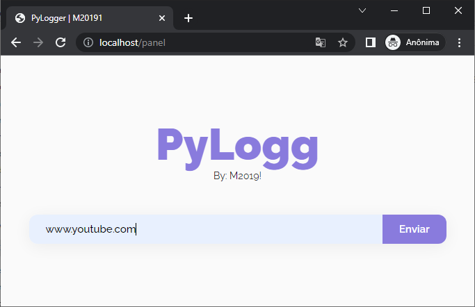
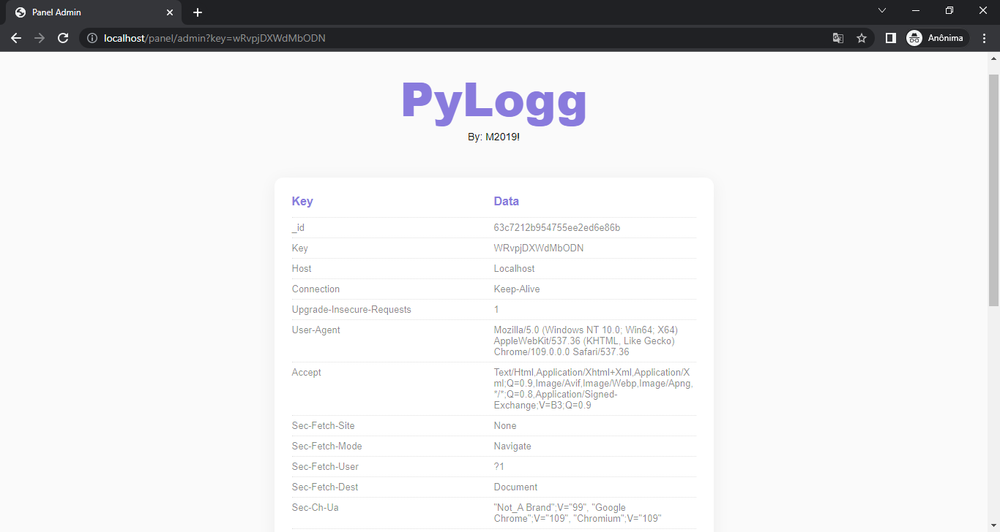

# Py-Logg

<p align=center><a href="#"><a></p>
<p align="center">
  <a href="#"></a>
  <a href="#"></a>
  <a href="#"></a>
</p>

Open source project dedicated to "hiding" an iplogger in a normal url

## 🛠 Downloading repo, cd path and install requirements:
```console
git clone https://github.com/M20191/py-logg && cd py-logg/ && pip install -r requirements.txt
```

## 🖥 How to run Main file in Linux (python3) and Windows (py):
```console
python3 .\run.py
py .\run.py
```

## 📷 Web Media
### Short Url


### Options


### Admin Panel
